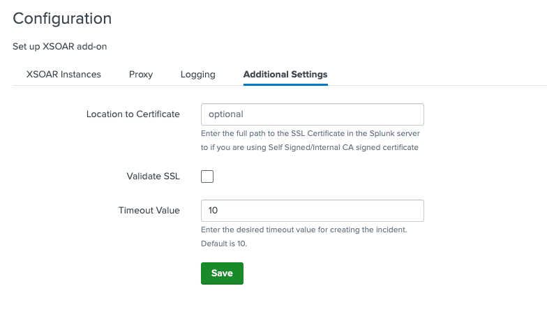

# Demisto Add-on for Splunk
Supporting Add-on for Cortex XSOAR. This application allows a user to push incidents into Cortex XSOAR from Splunk using a custom alert action.


# Requirements
* Splunk version 8.0 >=

# Development Setup for Using the Demisto Add-on in Splunk

- [Demisto Add-on for Splunk](#demisto-add-on-for-splunk)
- [Requirements](#requirements)
- [Development Setup for Using the Demisto Add-on in Splunk](#development-setup-for-using-the-demisto-add-on-in-splunk)
    - [Prepare a local Splunk Environment](#prepare-a-local-splunk-environment)
    - [Installation of the add-on](#installation-of-the-add-on)
    - [Configuration](#configuration)
    - [Connectivity Test - Create a Custom Alert Action](#connectivity-test---create-a-custom-alert-action)
    - [About Add-on Builder, AppInspect and Compatibility](#about-add-on-builder-appinspect-and-compatibility)
    - [Regenerating the Add-on with Add-on Builder](#regenerating-the-add-on-with-add-on-builder)
    - [Tips for Developers](#tips-for-developers)
    - [Common Issues - SSL Certificates](#common-issues---ssl-certificates)

### Prepare a local Splunk Environment
Run the following command to create a Splunk docker container (replace the `*****` with any 8-character password, containing letters and digits):
```
docker run -d -p "8000:8000" -p "8088:8088" -p "8089:8089" -e "SPLUNK_START_ARGS=--accept-license" -e "SPLUNK_PASSWORD=*****" --name splunk splunk/splunk:latest
```
Once executed, the splunk env will be available at http://localhost:8000.

### Installation of the add-on
* Download Demisto Add-on for Splunk from [Splunkbase](https://splunkbase.splunk.com/app/3448).
* After initializing the container, open your local Splunk environment.
* Go to “Manage Apps” → Install app from file → upload the latest version of Demisto Add-on for Splunk.
  *Note:* if a version of the app already exists, mark the “Upgrade app” checkbox.
  
  
* Restart Splunk and login again.


### Configuration
* In order to use the add-on and create incidents in XSOAR, you must complete the setup of the application. Press "Launch app" action after installing the add-on and provide the following:
    1) Create a XSOAR instance:
       Under XSOAR Instances tab, press the "Add" button. Choose an instance name, and fill the XSOAR server URL (including port if needed) and the API key fields. The API key is used for authorization with XSOAR. In order to generate this parameter, a user should log in to Demisto and then click on Settings → Integration → API Keys.
      
       *Note:* When using XSOAR v8 and above, an *Advanced API key* (standard keys are not supported) should be generated and be inserted as follows: <API_KEY>$<KEY_ID>


       
    2) Set up proxy settings (optional):
       Under Proxy tab, check the "Enable" checkbox and fill all the proxy parameters needed.
    3) Choose log level (optional):
       By default, the logging level is "INFO". You may change the logging level to "DEBUG" if needed.
    4) Additional Settings (optional):
       - If you have an SSL certificate, provide its full path under the **"Location to Certificate"** field.
       - By default, **"Validate SSL"** is enabled.
       - If you would like to extend the incident creatiin request timeout, provide the desired timeout under the "Timeout Value" field.
    By default, timeout value is 10 seconds.
       
       
* You must restart Splunk in order to apply changes in the configuration settings.

       
### Connectivity Test - Create a Custom Alert Action
* Upload data to Splunk (any small PDF, CSV or YML file is ok).

  
* When the file is uploaded, click "Start Searching" and save the search as an Alert (on the top-right corner).
  * Complete the Alert settings:
      1. Title
      2. Permissions – Shared in App
      3. Alert type – Run on Cron Schedule
      4. Cron Expression – * * * * * (every 1 minute)
  
  * Press "Add Actions" and choose **Create XSOAR Incident**, from which you can setup the alert incident details:
      1. Name - name of the alert
      2. Time Occurred - time when alert was triggered
      3. XSOAR Server (if “Send Alert to all the servers” is unchecked)
      4. Type – incident type in XSOAR
      5. Custom Fields - A comma separated 'key:value' custom fields pairs. If a value contains commas or colons, it should be wrapped with apostrophes, quotation marks, backticks, parenthesis or curly brackets.
      6. Labels – a comma separated values to be put in the labels field
      7. Severity – the alert severity
      8. Details – “details” field of the incident

* Go to the XSOAR server and wait for incidents (one for each event in Splunk).

  

* *Note:* Saved Alerts can be found under Search & Reporting → Alerts.


### About Add-on Builder, AppInspect and Compatibility
* Versions 3.0.0 and above of the add-on were built using **Splunk Add-on Builder**, which simplified the latest upgrade of the add-on and the required python 2 and 3 compatibility process. Click [here](https://docs.splunk.com/Documentation/AddonBuilder/latest/UserGuide/Overview) to learn more about the Add-on builder.
* Splunkbase’s way to validate their apps is called **AppInspect**. Our splunk-app repository on github has a build which sends the modified version of the add-on to AppInspect.

  
* When bumping a version of the add-on in Splunkbase, we need to make sure it’s **compatible** with **Splunk Enterprise** and **Splunk Cloud**.

  


### Local Compatibility Testing
Before bumping a version or merging changes, you can run the whole compatibility
pipeline **locally** with [`scripts/test_compatibility.sh`](../scripts/test_compatibility.sh).
It mirrors what CI does, but runs entirely on your machine and adds real
pass/fail verification — including, optionally, creating a **live incident** in
XSOAR (v6 and/or NG) and confirming it through the XSOAR REST API.

The script runs these stages and exits non-zero if any executed stage fails:

1. **Preflight** – verify Docker and tooling are available.
2. **Lint/tests** – `flake8` + `pytest` (the same commands CI runs).
3. **Package** – build the `.tgz` SPL (identical to the CI `tar` command).
4. **AppInspect** – static compatibility checks via the `splunk-appinspect`
   Python CLI (offline; no Splunk.com credentials needed).
5. **Runtime** – boot `splunk/splunk:<version>` with the add-on bind-mounted.
6. **Health** – poll container health until healthy.
7. **Verify** – REST call (management port) confirms the add-on is loaded/enabled.
8. **Logs** – scan `splunkd.log` + the add-on log for `TA-Demisto` errors.
9. **XSOAR** *(opt-in)* – create a live incident in each configured XSOAR flavor
   and confirm it via the REST API.

#### Prerequisites
* **Docker** running locally.
* **Python + pipenv** for the lint/test stage (`pipenv install --dev`).
* **libmagic** for the AppInspect stage. On macOS:
  ```
  brew install libmagic
  export DYLD_LIBRARY_PATH=/opt/homebrew/lib   # Apple Silicon Homebrew path
  ```
* On **Apple Silicon / arm64**, Splunk images are `linux/amd64`-only for many
  tags, so the script defaults to `--platform linux/amd64` (run via emulation).

#### Configuration (`.env`)
The script reads its configuration from a `.env` file in the repo root (this
file is git-ignored — never commit real secrets). There are **no hardcoded
credentials in the script**; the Splunk admin credentials come solely from
`.env`:

| Variable | Purpose |
| --- | --- |
| `SPLUNK_USERNAME` / `SPLUNK_PASSWORD` | Splunk container admin credentials (**required** for the runtime/verify/xsoar stages). The Splunk image provisions an `admin` account; the password must satisfy Splunk's [password policy](https://splunk.github.io/docker-splunk/ADVANCED.html). |
| `DEMISTO6_BASE_URL` / `DEMISTO6_API_KEY` | XSOAR **v6** connection (used by `--xsoar`). |
| `DEMISTO8_BASE_URL` / `DEMISTO8_API_KEY` / `DEMISTO8_AUTH_ID` | XSOAR **NG** (v8+) connection — Advanced API key format `<API_KEY>$<KEY_ID>` plus the NG REST endpoints (used by `--xsoar` / `--xsoar-ng`). |

When `--xsoar` is passed, the script auto-detects which flavor(s) are configured
in `.env` and runs against **each present flavor** (v6, NG, or both). Use
`--xsoar-ng` to restrict the run to XSOAR NG only.

#### Common invocations
```bash
# Full pipeline against the latest Splunk image
scripts/test_compatibility.sh

# Test a specific Splunk version
scripts/test_compatibility.sh --splunk-version 10.2.6

# Full pipeline plus live XSOAR incident creation (auto-detects v6/NG/both)
scripts/test_compatibility.sh --xsoar

# XSOAR NG only, keeping the container up afterwards for debugging
scripts/test_compatibility.sh --xsoar-ng --keep-container

# Skip the slower stages while iterating on the XSOAR flow
scripts/test_compatibility.sh --skip-tests --skip-appinspect --xsoar
```

#### Options
| Option | Description |
| --- | --- |
| `--image <ref>` | Splunk image to test against (default `splunk/splunk:latest`). |
| `--splunk-version <v>` | Shorthand for `--image splunk/splunk:<v>` (e.g. `10.2.6`). Defaults to `latest` when omitted. |
| `--platform <p>` | Docker platform for the Splunk image (default `linux/amd64`). |
| `--xsoar` | Run the live XSOAR incident-creation stage against each configured flavor. |
| `--xsoar-ng` | Like `--xsoar` but restricts the run to XSOAR NG (v8+). |
| `--instance <name>` | (Optional) XSOAR instance name configured in the add-on. |
| `--skip-tests` | Skip `flake8` + `pytest`. |
| `--skip-appinspect` | Skip the AppInspect static stage. |
| `--skip-runtime` | Skip the runtime/health/verify/logs/xsoar stages. |
| `--keep-container` | Leave the Splunk container running on exit (for debugging). |
| `-h`, `--help` | Show help and exit. |


### Regenerating the Add-on with Add-on Builder
Some AppInspect checks (for example `check_for_addon_builder_version`, which requires the builder version to be at least 4.5.0) can only be satisfied by re-generating the add-on with an up-to-date **Splunk Add-on Builder**. Follow these steps to regenerate it and pull the result back into the repo.

1. **Install Splunk Add-on Builder into your local Splunk.**
   - In Splunk Web go to **Apps → Manage Apps**.
   - Click **Browse more apps** (top-right) and log in with your Splunk.com account.
   - Search for **Add-on Builder**, install it, and restart Splunk when prompted.

2. **Make sure the Demisto add-on is installed in Splunk.**
   - If it isn't already installed, go to **Manage Apps → Install app from file** and upload the latest package from [`add-on/spls`](spls) (for example the highest-numbered `demisto-add-on-for-splunk-*.tgz`). Restart Splunk when prompted.

3. **Open the project in Add-on Builder and export it.**
   - Open **Splunk Add-on Builder**.
   - Under **Other Apps and Add-ons**, search for **"Demisto add on for splunk"** and open it.
   - Click **Validate** to run the builder's checks, then **Download Package** to export a fresh `.spl`.

4. **Replace the repo's add-on directory with the freshly generated one.**
   - Extract the downloaded `.spl` (it is a `.tgz` archive) — it contains a `TA-Demisto/` directory.
   - Replace the repo's [`add-on/TA-Demisto`](TA-Demisto) directory with the extracted `TA-Demisto/` directory.

5. **Track the changes and keep only the real ones.**
   - Keep **only** the intended change — typically the bumped `builder_version` in [`add-on/TA-Demisto/default/addon_builder.conf`](TA-Demisto/default/addon_builder.conf).
6. **Verify AppInspect passes** (see the section above) before committing.

### Tips for Developers
1. The main python script which handles the incidents creation is found on our splunk-app repo under `add-on/TA-Demisto/bin/ta_demisto/modalert_create_xsoar_incident_helper.py`.
   An additional script is `modalert_create_xsoar_incident_utils.py` on the same directory. 
   **Any other python file shouldn’t be touched** unless we need to modify the configuration parameters.
   
   **Useful links to learn more about splunk add-ons structure:**
   - App Directory Structure: https://dev.splunk.com/enterprise/docs/developapps/createapps/appdirectorystructure/
   - Configuration Files: https://docs.splunk.com/Documentation/Splunk/8.1.0/Admin/Aboutconfigurationfiles
   - Splexicon – the Splunk glossary: https://docs.splunk.com/Splexicon

2. In case something is not working and we are not sure what happened, we have two kinds of logs:
   - `splunkd.log` – for Splunk issues
   - `create_xsoar_incident_modalert.log` – for the add-on issues

   We can reach them from the container by typing:
   ```
   docker exec -it splunk bash
   sudo cat var/log/splunk/<log_filename>.log
   ```

3. If you need to update the add-on, make sure to do the following:

   a. Bump the add-on version when you make changes in the add-on. The version should be updated in three locations:

      - `add-on/TA-Demisto/appserver/static/js/build/globalConfig.json` (only the “version” field, and not the “apiVersion” field)
      - `add-on/TA-Demisto/default/app.conf`
      - `add-on/TA-Demisto/app.manifest`

   b. Add a compressed (.tgz) file of your version under add-on/spls path.
      To create a compressed file from your local repository, run the following command on the root directory (replace xxx with new version):
      ```
      pushd add-on && COPYFILE_DISABLE=1 tar -cvzf spls/demisto-add-on-for-splunk-xxx.tgz --exclude={'*.pyc','*DS_Store'} TA-Demisto && popd
      ```

   c. Verify AppInspect passes in the build.

   d. Upload your new version to Splunkbase (ADMINISTRATOR TOOLS → Manage app → NEW VERSION) - make sure the new version is compatible with Splunk Cloud and Splunk Enterprise.

      

### Common Issues - SSL Certificates
* **If you don’t use a certificate, make sure the “Validate SSL” checkbox is unmarked.**
* **If the client has a self-signed certificate, we must add it to the Splunk server first, and then set the path to it in the Add-on setup page.**
* In the case of a self-signed certificate, make sure that the **whole** certificate chain exist. If you won’t have the root, intermediate, and client certificates it won’t work (explanation about how it works can be found here).
* SSL certificates are signed on server domain rather than its IP – important as sometimes clients check validity by pinging the server IP.
